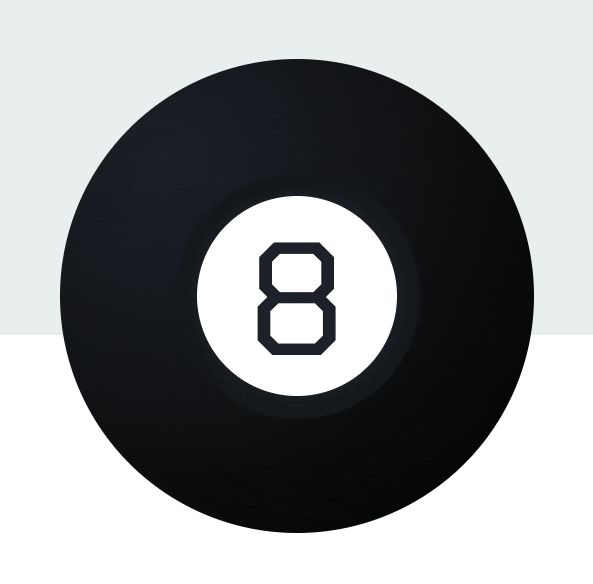

<h1 align="center">Welcome to my Bright Paths Foundation Capstone:  8-Ball Fortune Teller 👋</h1>

  
  

## Table of contents

- [Overview](#overview)
  - [Project Goal](#project-goal)
  - [Reasons for choosing this project](#reasons-for-choosing-this-project)
  - [Screenshot](#screenshot)
  - [Links](#links)
- [My Process](#my-process)

  - [Technologies Used](#technologies-used)
  - [Build Features](#build-features)
  - [What I Am Proud Of](#what-i-am-proud-of)
  - [Continued development](#continued-development)

- [Author](#author)

## Overview

### Project Goal:

Build a digital experience that rivals the experience of playing with the real Magic Eightball, currently produced by Mattel.

### Reasons for choosing this project:

- Practicality
- Creative way to build a CRD (no U) application
- Chance to learn by doing

### Screenshot

### Links

- Solution URL: [Github](https://github.com/MSPayneII/foundations-capstone)
- Live Site URL: [Heroku](https://mpayne-foundation-capstone.herokuapp.com/)

## My Process

### Technologies Used:

- Axios
- Express
- Javascript
- HTML
- CSS

## Build Features:

- Users can enter questions to ask the eight ball
- Users will receive a randomized answer to their question via an animation displayed on the eight ball
- Q&As will save and display on screen for users
- Saved Q&As are erased by refreshing the browser

## What I am proud of:

- Figuring out a way to combine async and synchronous code and time it so all aspects of the eightball animation flow together

### Continued development

- Build 8-Ball Fortune Teller version 2 in React, using functional components and React Hooks

- Add form validation with visual cues for the user

- Update css variable naming convention

- Add side navigation bar with links to eightball display and saved responses. They will be on separate pages but will display on the main landing page

## Author

👤 **Michael Payne**

- Website: [Michael Payne] (https://michaelspayneii.com/)
- Github: [@MSPayneII](https://github.com/MSPayneII)
- LinkedIn: [@michaelspayneii](https://linkedin.com/in/michaelspayneii)

_This README was generated with ❤️ by [readme-md-generator](https://github.com/kefranabg/readme-md-generator)_
